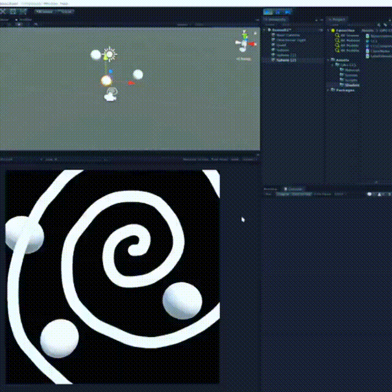
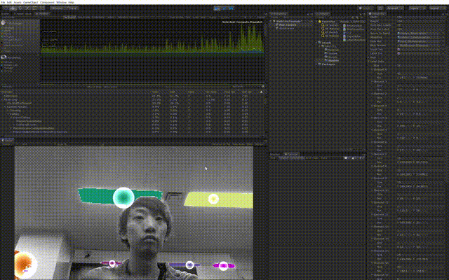

# CCL-GPU

Connected component labeling (CCL) using Unity ComputeShader

- Implemented with reference to this slide
- https://www.slideshare.net/QuentinKang/fast-cclconnected-component-labeling-with-gpu

## Captures

labeling step by step

---

label via brightness